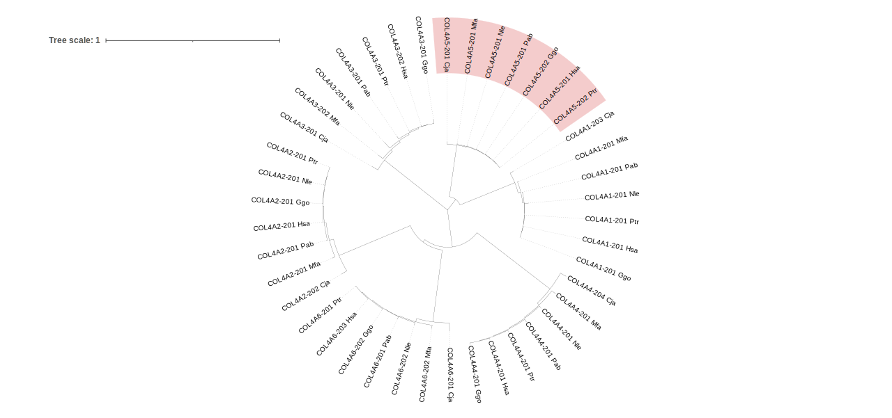
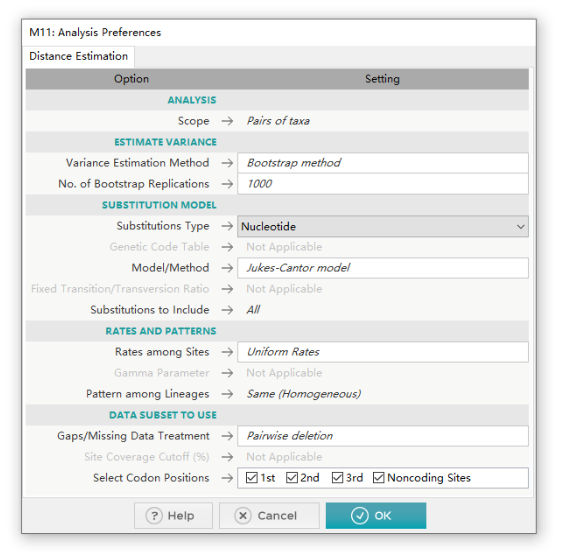
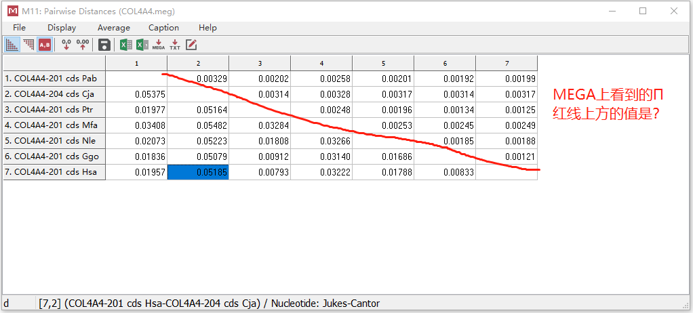
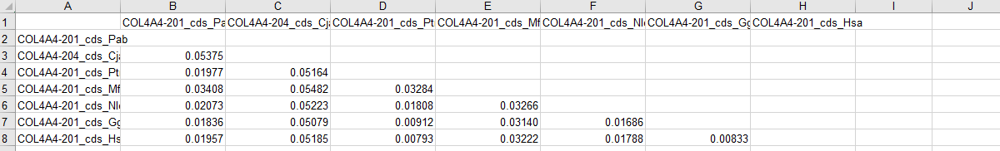
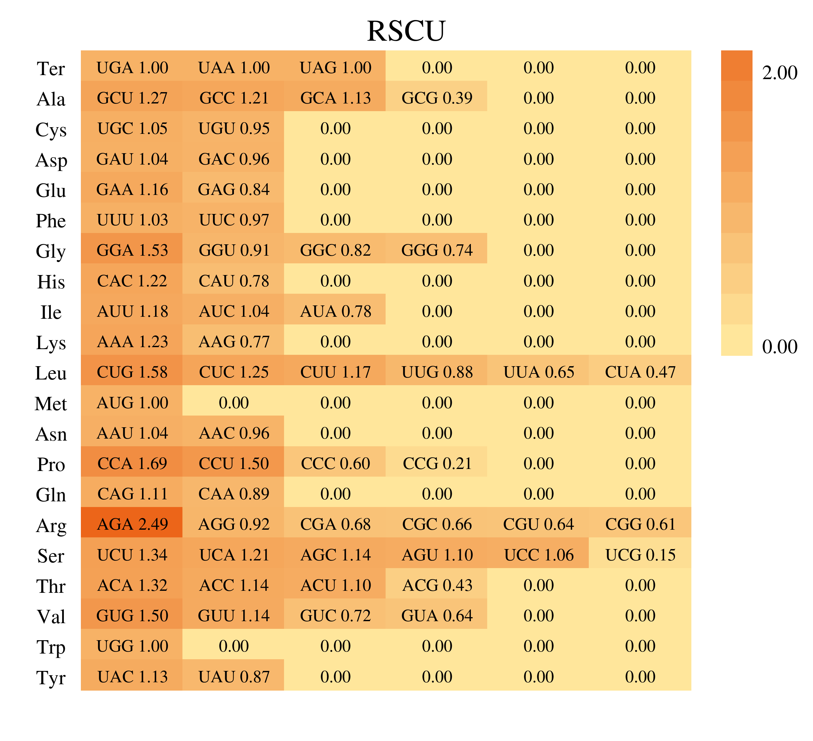
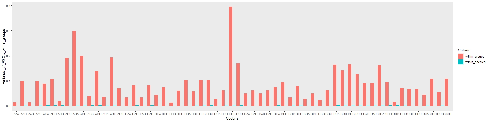
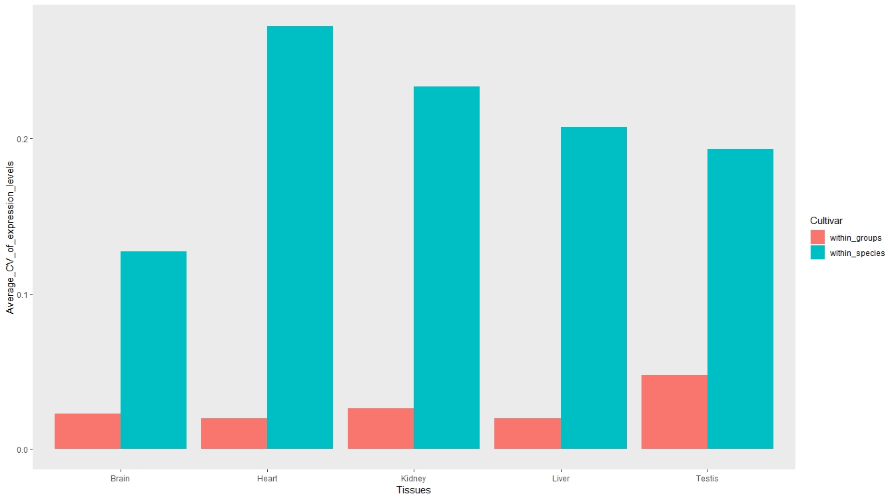

>工作计划时间线：  
2022.07.22-2022.08.10将如下有关胶原蛋白演化的工作完成;  
2022.08.10-2022.08.20从上述工作结果中探讨其它方面。

# 一、灵长目中IV型胶原基因的演化（参考肌动蛋白演化的标准演化方法）
## 1、确定研究对象及基因
+ 研究对象：
```
7个灵长目物种：
human (Homo sapiens)  
chimpanzee (Pan troglodytes)  #黑猩猩
gorilla (Gorilla gorilla)  #大猩猩
Sumatran orangutan (Pongo abelii)  #苏门答腊猩猩
gibbon (Nomascus leucogenys) #长臂猿 
crab-eating macaque (Macaca fascicularis) #长尾猕猴
White-tufted-ear marmoset (Callithrix jacchus)  #普通狨猴
```
+ 确定IV型胶原基因
```
在ensemble官网进入相应物种界面，搜索COL4,点击基因，去掉ncRNA、假基因、结合蛋白之类后，查看得：
7个物种均有6个IV型胶原基因,:COL4A1 COL4A2 COL4A3 COL4A4 COL4A5 COL4A6
```
## 2、多序列比对和建树  
（此步我输入MEGA的文件是CRLF，多序列比对完保存的是.meg格式进行的后续分析）
+ 下载、整理7个物种IV型胶原蛋白基因的氨基酸序列和CDS序列 
```
下载：进入ensemble官网下选相应物种，每个基因暂取最长的转录本对应的蛋白序列和CDS序列，手动下载。（其实我想用命令行通过FTP下载再保留最长转录本再提取，但一时没想好怎么用命令行完成，暂且手动下载） 
注：下载过程中，搜索Gorilla基因时Only searching Western Lowland Gorilla; 搜索Gibbon基因时Only searching Northern white-cheeked gibbon  
添加后缀：为每个物种中的序列名添加后缀，规则是学名的三个字母，如人用Hsa作为后缀;cds序列在后缀前加_cds用以与氨基酸序列区分
合并序列：以合并7个物种氨基酸序列为例：  
JOB=$(ls)
 for i in $JOB ; do cat $i >> protein.all.fa ; done  
 cat protein.all.fa | grep ">" | wc -l #42  
```
+ 氨基酸与cds序列的多序列比对及建树
```
使用muscle多序列比对，保存为mega格式 参数默认  
NJ建树 参数默认 建出的树COL4A5确实与COL4A1挺近 树的PDF文件见文件夹MEGA内的protein和cds文件夹
氨基酸序列得到的Original Tree见下图1：有个小疑问：氨基酸序列得到的Original Tree直接从MEGA导出时是两大分支，在iTOL是三个大分支，为什么？
```
  
图1——氨基酸序列得到的Original Tree
+ 分组
```
很明显，可以分为6个直系同源组（每个物种的基因出现一次），没有complex组（一个物种的一个基因多拷贝或少于一个拷贝）.
```
+ 计算Ka Ks和Π
```
1.  
计算ka ks（6个直系同源组，所以分6次计算，每次里分别算ka ks）  
整理6个直系同源组的序列
 cat cds.all.fa | grep "COL4A1" | cut -d ">" -f 2 >COL4A1.lst  
 faops some cds.all.fa COL4A1.lst ./COL4A1/COL4A1.fa
   
cat cds.all.fa | grep "COL4A2" | cut -d ">" -f 2 >COL4A2.lst  
 faops some cds.all.fa COL4A2.lst ./COL4A2/COL4A2.fa

cat cds.all.fa | grep "COL4A3" | cut -d ">" -f 2 >COL4A3.lst  
 faops some cds.all.fa COL4A3.lst ./COL4A3/COL4A3.fa

cat cds.all.fa | grep "COL4A4" | cut -d ">" -f 2 >COL4A4.lst  
 faops some cds.all.fa COL4A4.lst ./COL4A4/COL4A4.fa

cat cds.all.fa | grep "COL4A5" | cut -d ">" -f 2 >COL4A5.lst  
 faops some cds.all.fa COL4A5.lst ./COL4A5/COL4A5.fa

cat cds.all.fa | grep "COL4A6" | cut -d ">" -f 2 >COL4A6.lst  
 faops some cds.all.fa COL4A6.lst ./COL4A6/COL4A6.fa  

多序列比对，使用MUSCLE 参数默认  
使用MEGA计算Ka Ks，步骤见Dynamic Actin Gene Family Evolution in Primates.md  
结果见Table1和supplement.table  
疑问：文章Dynamic Actin Gene Family Evolution in Primates（以下简称肌动蛋白文章）的Table1的ka/ks是怎么算出的，似乎不是附表里ka/ks的平均值。另外肌动蛋白文章中说Whether in orthologous groups or
complex groups, the average 𝐾𝑎/𝐾𝑠 ratios of most groups(82.4%) are much smaller than 1 (only six groups of average 𝐾𝑎/𝐾𝑠 ratios are greater than 0.5, all of them belong to
complex groups), indicating that the actin genes code highly conserved proteins because of important functions and were under strong negative selection.从𝐾𝑎/𝐾𝑠 ratios可以看出选择压力我理解，但怎么indicating肌动蛋白基因编码高度保守的蛋白呢？  

2.
计算Π
见教程https://blog.csdn.net/qq_50637636/article/details/122612457  
使用的参数见图2  
有一个小疑问：MEGA给出Π的结果是只有对角线没有值，但导出为excel后，少了上面一部分值，其实我个人认为两个序列之间的核苷酸差异和这两个序列前后没有关系，序列1与序列2的差异和序列2与序列1的差异应该一样才是，所以没上面的结果也正常，看了两个肌动蛋白文章附表2的两个序列的PI，序列顺序不同，结果同。 
我得出的Π的结果见Evolution_/IV_collagen下的Table1和supplement.table 
```


  
图2

  
图3——MEGA上看到的Π结果
  
图4——Π导出为excel后看到的结果  

## 3、鉴定IV型胶原假基因
可能找不到假基因。假若有假基因，由假基因推核苷酸内秉突变率。
+ BLASTN
```
#将IV型胶原基因的核苷酸序列（暂以上步下载的CDS序列做）和对应物种基因组序列比较
#chimpanzee
makeblastdb -in ./Pan_troglodytes.Pan_tro_3.0.dna.toplevel.fa -dbtype nucl -parse_seqids -out ./index
blastn -query ./chimpanzee.cds.fa -db ./index -evalue 1e-5 -outfmt 6 -num_threads 4 -out out_file1
```
#结果解读：输出格式选择 6 （--outfmt 6） ，默认输出为：qseqid sseqid pident length mismatch gapopen qstart qend sstart send evalue bitscore 。

图5 BLASTN_format6  
  
(echo -e "qseqid\tsseqid\tpident\tlength\tmismatch\tgapopen\tqstart\tqend\tsstart\tsend\tevalue\tbitscore" && cat out_file1) > tem&&
    mv tem out_file1 # 添加表头   

不太清楚怎么从结果中去除已知的胶原蛋白基因。  

换另一种输出格式：blastn -query ./chimpanzee.cds.fa -db ./index -evalue 1e-5 -outfmt 0 -num_threads 4 -out out_file2


## 4、密码子使用情况
使用在线网站使用在线网站计算RSCU，网址：http://cloud.genepioneer.com:9929/#/tool/alltool/detail/214  
在线网站返回的结果log.txt里显示 start codon is wrong(ATG)，但由于后续会把起始密码子删去，所以暂不认为此错误有影响。  
将结果整理为tsv文件（全选在线网站解压出的excel的内容，粘贴到新建的的LF的tsv文件。之所以要用LF是因为tsv-filter对CRLF的文件会报错。注意在VSCode打开一个空tsv或只有一行的tsv，就算改成LF保存再打开仍是CRLF，但有两行文字时由CRLF改成LF保存再打开即为LF.）  
对人六个IV型胶原蛋白基因的cds进行RSCU分析后，用在线软件生成热图，见图6.  
  
图6


+ 对数据进行预处理（删除终止密码子和ATG、TGG）
```
cd RSCU
JOB=$(find ./ -maxdepth 2 -type f -name "*.tsv")
for J in $JOB;do
  echo -e "====> $J"
  tsv-filter -H --str-ne Codon:UAA $J | 
  tsv-filter -H --str-ne Codon:UAG | 
  tsv-filter -H --str-ne Codon:UGA |
  tsv-filter -H --str-ne Codon:AUG |
  tsv-filter -H --str-ne Codon:UGG > tem&&
  mv tem $J
done
```
+ 合并
```
cd within_groups/
JOB=$(ls)
tsv-select -H --fields Codon o1.tsv > merge.tsv
for J in $JOB;do
  echo -e "===> $J"
  tsv-join --filter-file $J -H --key-fields Codon --append-fields RSCU merge.tsv > tem
    mv tem merge.tsv
done
```
```
cd within_species/
JOB=$(ls)
tsv-select -H --fields Codon 0.tsv > merge.tsv
for J in $JOB;do
  echo -e "===> $J"
  tsv-join --filter-file $J -H --key-fields Codon --append-fields RSCU merge.tsv > tem
    mv tem merge.tsv
done
```
 
+ 计算方差
但我不确定方差和肌动蛋白文章中说的variation不是一个意思。正在琢磨。暂时以方差进行计算和画图。
```
#利用datamash中的svar计算(brew install datamash)
datamash --help

# 查看矩阵
head merge.tsv

# 计算
cat merge.tsv | datamash transpose | datamash --header-in --header-out svar 2-60 | datamash transpose > svar.tsv
# transpose 转置
# --header-in           first input line is column headers
# --header-out          print column headers as first line
```
+ R画图   
within_groups和within_species分开作图以及合并为簇状条形图都在下方写了过程。展示的图6是簇状条形图。
```
#within_groups
setwd("D:/0~GitHub/Evolution_/IV_collagen/RSCU/within_groups")
group_svar <- read.table("svar_within_groups.tsv",header=FALSE,sep='\t')
library(ggplot2)
p <- ggplot(group_svar,aes(V1,V2))+geom_bar(stat = 'identity')+ylab("variance of RSCU within groups") +xlab("Codons")+ theme(panel.grid = element_blank())
p

#within_species
setwd("D:/0~GitHub/Evolution_/IV_collagen/RSCU/within_species")
species_svar <- read.table("svar_within_species.tsv",header=FALSE,sep='\t')
library(ggplot2)
p <- ggplot(species_svar,aes(V1,V2))+geom_bar(stat = 'identity')+ylab("variance of RSCU within species") +xlab("Codons")+ theme(panel.grid = element_blank())
p
```
```
画簇状条形图
#整理数据
cd R #进入新文件夹
(echo -e "Codons\tvariance_of_RSCU_within_groups" && cat svar_within_groups.tsv) > tem&&
    mv tem svar_within_groups.tsv # 添加表头 
#手动创建cultivar.tsv
paste cultivar.tsv svar_within_groups.tsv >svar_within_groups_paste.tsv #按列合并，也相当于增加新列

(echo -e "Codons\tvariance_of_RSCU_within_species" && cat svar_within_species.tsv) > tem&&
    mv tem svar_within_species.tsv # 添加表头 
#手动创建cultivar.tsv
paste cultivar.tsv svar_within_species.tsv >svar_within_species_paste.tsv

#合并，按行追加 到RSCU目录
cat svar_within_species_paste.tsv >> svar_within_groups_paste.tsv
手动删中间表头
mv svar_within_groups_paste.tsv svar_within_groups_species.tsv
setwd("D:/0~GitHub/Evolution_/IV_collagen/RSCU")
svar <- read.table("svar_within_groups_species.tsv",header=TRUE,sep='\t')
library(ggplot2)
ggplot(svar, aes(x = Codons, y = variance_of_RSCU_within_groups, fill = Cultivar)) +geom_bar(position = "dodge", stat = "identity")+ theme(panel.grid = element_blank())
#见图7,可见物种间有相似的密码子使用模式，相比起来直系同源组间使用模式更多样化。
```

图7 variations of RSCU

## 5、IV型胶原基因表达模式
进入http://www.ebi.ac.uk/arrayexpress，搜索E-AFMX-11，下载文件 (后续可以找更新一点的表达量数据)  
 A-AFFY-44.adf.txt为提供了探针的各种注释信息  
尝试提取表达值：  
安装affy包 BiocManager::install("affy")  
setwd("D:/0~GitHub/Evolution_/IV_collagen/EXPRESSION/")  
BiocManager::install("GEOquery")  
library(GEOquery)  
write.table(data.frame(fData(study),exprs(study)),file="expression.txt",row.names=FALSE,sep="\t") #提取表达值，但没有基因对应  

WYF师兄帮我整理了表达水平的文件，见expression.txt,该文件每行开头为基因名，每列最上是样本。  
出现的IV型胶原蛋白基因如下：
COL4A1
COL4A1
COL4A2
COL4A2
COL4A3
COL4A3
COL4A3
COL4A3
COL4A3
COL4A3
COL4A3
COL4A4
COL4A4
COL4A4
COL4A5
COL4A5
COL4A6
COL4A6
COL4A6  (即人和黑猩猩的6个IV型胶原基因都有检测到，并且不止一次，可能是不同探针。)

55个样本，其实是两个物种分别5个组织：  
C代表黑猩猩，H代表人，B,H,K,L,T分别代表脑，心，肾，肝，睾丸。CB,CH,CK,CL,CT各5个；HB,HH,HK,HL,HT各6个。所以共计55个样本。

因此求表达水平在不同组织中的平均值：
见excel表expression.xlsx  

整理好的数据见Table2.Average expression level of collagen IV genes from human and chimpanzee genomes in all the five tissues.  
整理用于作图的Table3 The coefficient of variation of the expression level values for collagen IV genes within species and within different groups in all the five tissues. 因为只研究人和黑猩猩的基因表达水平，所以Table3中Orthologous1只包括人和黑猩猩的COL4A1，其它组同理。最终用于作图的数据见Table3的Sheet2，将其整理到tsv文件，见Evolution_/IV_collagen/EXPRESSION/Figure_data.tsv

R中作簇状条形图：
```
setwd("D:/0~GitHub/Evolution_/IV_collagen/EXPRESSION/")
expression <- read.table("Figure_data.tsv",header=TRUE,sep='\t')
library(ggplot2)
ggplot(expression, aes(x = Tissues, y = Average_CV_of_expression_levels, fill = Cultivar)) +geom_bar(position = "dodge", stat = "identity")+ theme(panel.grid = element_blank())
```
结果见图8
  
图8  
结果表明，within_species在5个组织中平均CV均高于within_groups.表明物种内，比如人，六个基因执行不同功能，有不同的表达水平。而within_groups，比如Orthologous1里的来自人和黑猩猩的COL4A1，可能有相同的功能，平均CV较小。  


注：标准差可缩写为SD，在数学文本和方程中最常用小写希腊字母σ (sigma)表示总体标准差，或拉丁字母s表示样本标准差。——维基百科。注意计算CV(SD/mean)，在EXCEL中STDEV和AVERAGE使用时两个number之间以逗号连接而非加号。


# 二、IV型胶原中G-X-Y的演化探究（在标准演化之外的特征演化方面）
## 旁系同源(人）中GXY
+ 查看进化关系  
```
将人的6个IV型胶原基因的氨基酸序列和核苷酸序列进行多序列比对后建树，查看进化关系。  
其实第一部分标准演化的多序列中已经包含了这部分，在此只是单独做人的。  
将IV_collagen/sequence/下人6个基因的cds和protein复制到IV_collagen/PART2_GXY/Paralogs_GXY  
MEGA进行多序列比对，选muscel，参数默认  
MEGA对多序列比对完的序列建树，NJ法   
结果与第一部分标准演化没有大的区别。输出的pdf文件所在目录为Evolution_/IV_collagen/PART2_GXY/Paralogs_GXY 
```

+ 查看每个基因GXY repeat 中的的中断
```
Collagen repeat的范围来自于InterProScan
COL4A5：57始-1460末 22个中断 4个G1G 7个G4G
COL4A1: 46始-1440末 21个中断 7个G1G 5个G4G
COL4A2: 61始-1336末 23个中断 3个G1G 2个G4G 根据InterProScan查看Collagen repeat,与某篇文章报道的27个中断不同,我又往后延了一段GXY,与文献一样了。
COL4A3: 46始-1437末 23个中断 2个G1G 7个G4G
COL4A4: 62始-1370末 27个中断 4个G1G 5个G4G  根据InterProScan查看Collagen repeat,与某篇文章报道的27个中断不同,我又往后延了一段GXY，与文献一样了。其实repeat结束位置后面很长才有零星GXY出现。
COL4A6: 46始-1478末 25个中断 4个G1G 2个G4G
始和末之间并不是一直连续。

使用SnapGene Viewer 标注氨基酸序列的中断，保存为IV_collagen/PART2_GXY/Paralogs_GXY/interruption下的.prot

在手动标注中断的时候发现，有些GXY中的XY也有G，这些或许可以和1号位G对比研究？  
InterPro上说重复的第一个位置是甘氨酸，第二个和第三个位置可以是任何残基但通常是脯氨酸和羟脯氨酸。
```
+ 比较中断
```
对6个基因的氨基酸序列使用MEGA的muscel多序列比对  
因为在MEGA看比对完的结果不太方便，也不好做标记，所以导出到EXCEL分析。以COL4A5为参照，其中22个中断有14个（2，8到20）内是无gap-的，12个有-（1，3，4，5，6，7，21，22），说明这12个不是保守的中断。  
COL4A1的第11个中断在六个基因中位置一模一样都是G1G!
比较的结果见IV_collagen/PART2_GXY/Paralogs_GXY/interruption/下的interruption_after_alligned.xlsx的sheet3，截图结果见IV_collagen/PART2_GXY/Paralogs_GXY/interruption/下的word文件'人6个IV型胶原基因的中断比较.docx'

中断似乎有很多种分类情况，比如有无gap，包含与否等，所以具体如何判断古老和新出的中断呢？
中断看哪些较为古老，哪些较为新出。将CLO4A5基因出现的中断分类：一些COL4A5独有的、在6个基因中部分有、在6个基因中都有的（此类较为保守）


```
## 直系同源中GXY
用统计分析部分所选的6个等级31个物种（人科到北方兽类）的COL4A5基因的氨基酸序列多序列比对，比较中断。将人科作为参照，其它物种只考虑比对后人57-1460 Repeat区覆盖范围的中断。看哪些中断是古老是哪些是新的（人有而其它物种没有的可能是新的，人有而其它物种有的可能是老的），人不中断其它物种中断的位置可能不重要，因为允许在其它物种中中断。
中断的长度和位置也需要考虑，因为The location of interruptions is often similar for the three chains within a heterotrimer, while there may be different lengths of the interruptions at a given site in each of the three chains.[Thiagarajan G, Li Y, Mohs A, et al. Common interruptions in the repeating tripeptide sequence of non-fibrillar collagens: sequence analysis and structural studies on triple-helix peptide models. J Mol Biol. 2008;376(3):736-748. doi:10.1016/j.jmb.2007.11.075]
+ 人科——5个物种
```
人COL4A5的22个中断均保守，且在其它4个物种中均一样且保守(只是有的中断长度、位置一样但内部氨基酸不一样)。  
另外，有一个物种出现了一个人中没有的中断，对应的人氨基酸位点是1283-1287，说明这个位置可能不重要，因为允许在其它物种中断。
```
+ 狭鼻下目——12个物种
```
人COL4A5的22个中断均保守，且在其它物种中位置均一样（当然除去中断位置对应为-的物种），其中中断3，5，6，8，14在其它物种中与人氨基酸序列有的不同。  
一个物种出现了人没有的一个中断，对应人氨基酸序列位点1283-1287，说明这个位置可能不重要，因为允许在其它物种中断。
在1个物种中多了1个氨基酸M,对应人氨基酸位置810
```
+ 简鼻亚目——16个物种
```
人COL4A5的22个中断均保守,除了19号中断，其余中断在除了-的物种中也均保守且位置对应；有4个物种在人第19号中断（G4G型）变为G1G型中断，即位置和人不一样，而是被人中断位置包括。  
另外1个物种有一个人没有的新中断，对应人氨基酸位置214到215和216前的-
另外1个物种出现新中断，对应人氨基酸位置1283到1287
在1个物种中多了1个氨基酸M,对应人氨基酸位置810
```
+ 灵长目——20个物种
```
人COL4A5的22个中断均保守. 15,18,19号中断与其它物种中位置不完全一样。其余中断与其它物种中的中断位置一样（中断里的氨基酸序列有同有不同）。  
人15号中断（G4G）在4个物种中变为G1G，对应人氨基酸位置753  
人18号中断在1个物种变为G4G，对应人氨基酸位置954-957  
人19号中断（G4G）在8个物种变为G1G，对应人氨基酸位置1073  
1个物种有一个人没有的新中断，对应人氨基酸位置214到215和216前的-
1个物种出现新中断，对应人氨基酸位置1265-1269  
1个物种出现新中断，对应人氨基酸位置1283-1287
在1个物种中多了1个氨基酸M,对应人氨基酸位置810
```
+ 灵长总目——25个物种
```
人COL4A5的22个中断均保守,15,18,19号中断与其它物种中位置不完全一样。其余中断与其它物种中的中断位置一样.   
人15号中断（G4G）在7个物种中变为G1G，对应人氨基酸位置753  
人18号中断在1个物种变为G4G，对应人氨基酸位置954-957  
人19号中断（G4G）在13个物种变为G1G，对应人氨基酸位置1073  
1个物种有一个人没有的新中断，对应人氨基酸位置214到215和216前的-
1个物种出现新中断，对应人氨基酸位置1265-1269
2个物种出现新中断，对应人氨基酸位置1283-1287  
在1个物种中多了1个氨基酸M,对应人氨基酸位置810
```
+ 北方兽类——31个物种
```
人COL4A5的22个中断均保守. 5号中断在29个物种中位置相同，在1个物种中全是-，在1个物种中2个-  
15号中断在13个物种中变为G1G中断，对应人氨基酸位置753  
人18号中断在1个物种变为G4G，对应人氨基酸位置954-957 
人19号中断（G4G）在19个物种变为G1G，对应人氨基酸位置1073    
1个物种有一个人没有的新中断，对应人氨基酸位置214到215和216前的-  
1个物种出现新中断，对应人氨基酸位置679-683
1个物种出现新中断，对应人氨基酸位置1265-1269 
4个物种出现新中断，对应人氨基酸位置1283-1287  
1个物种多了1个氨基酸M，对应人氨基酸位置810  
1个物种中多了2个氨基酸MK，对应人氨基酸序列154，155
```
神奇的是一个物种的氨基酸是从G开始而不是M，开始即GXYGXY  
********************************************************

用统计分析部分所选的6个等级31个物种（人科到北方兽类）的COL4A3基因的氨基酸序列多序列比对，比较中断。将人科作为参照，其它物种只考虑比对后人46-1437 Repeat区覆盖范围的中断。  
下载31个物种COL4A3基因的最长转录本对应氨基酸序列  
注：原先第31个物种为Pig，现为Pig-Duroc  
合并为一个文件,在6个文件夹中分别运行如下命令
```
JOB=$(ls)
 for i in $JOB ; do cat $i >> renke.fa ; done  

JOB=$(ls)
 for i in $JOB ; do cat $i >> xiabixiamu.fa ; done 

JOB=$(ls)
 for i in $JOB ; do cat $i >> jianbiyamu.fa ; done 

JOB=$(ls)
 for i in $JOB ; do cat $i >> lingzhangmu.fa ; done 

JOB=$(ls)
 for i in $JOB ; do cat $i >> lingzhangzongmu.fa ; done 

JOB=$(ls)
 for i in $JOB ; do cat $i >> beifangshoulei.fa ; done 

```
使用MEGA的muscle进行多序列比对
比对完将结果复制到EXCEL方便标注中断，复制到EXCEL的结果在灵长总目和北方兽类出现名称不合适的现象，加了单引号后正常显示，并与原序列进行了比对，是一致的。  
+ 人科
```
人COL4A3的23个中断均保守（即中断内部没有-），其中有18个中断和其它4个物种的中断位置相同且均保守（在此保守意思是这些中断内部没有-，但是并不是说几个物种中断内部氨基酸都一样）。  
人4号中断在1个物种有变化，变化后的中断位置对应人氨基酸位置281-317及318前的-  
人11号中断在1个物种中改变，对应人氨基酸位置585-655（跨人的11、12、13号中断）  
人12号中断在1个物种中为-，1个物种非G1G，而是G4G  
人13号中断被人11号中断1个物种的改变所涉及，人13号中断在包括人在内的4个物种中保守且位置相同  
人20号中断在1个物种变为G3G  
1个物种出现新中断，对应人氨基酸位置503和504及之间  
1个物种出现新中断，对应人氨基酸位置778-782
```

+ 狭鼻下目
```
人COL4A3的23个中断均保守，其中有15个中断和其它物种的中断位置相同且均保守（除去中断被-覆盖的物种）.保守在此含义是内部无-  
人4号中断在1个物种有变化，变化后的中断位置对应人氨基酸位置281-317  
人6号中断在1个物种中中断改变，变化后的中断位置对应人氨基酸位置385-445，跨人中断6，7，8  
人7号中断涉及6改变的中断，其余11个物种中断保守且位置一样  
人8号中断涉及6改变的中断，其余11个物种中断保守且位置一样  
人11号中断在1个物种中改变，对应人氨基酸位置585-655（跨人的11、12、13号中断），在其余11个物种（含人）中断保守且位置一样  
人12号中断在1个物种中为-，1个物种非G1G，而是G4G对应人615-618. 其余10个物种（含人）中断保守且位置一样    
人13号中断涉及11那个变的中断，其余11个物种（含人）中断保守且位置一样  
人20号中断在1个物种变为G3G   
1个物种出现新中断，对应人氨基酸位置292-317  
1个物种出现新中断，对应人氨基酸位置503，504及之间  
1个物种出现新中断，对应人氨基酸位置778-782
```

+ 简鼻亚目
```
人COL4A3的23个中断均保守，其中有14个中断和其它物种的中断位置相同且均保守  
人4号中断在1个物种有变化，变化后的中断位置对应人氨基酸位置281-302；人4号中断在1个物种有变化，变化后的中断位置对应人氨基酸位置281-317   
人6号中断在1个物种中中断改变，变化后的中断位置对应人氨基酸位置385-445，跨人中断6，7，8    
人7号中断涉及6改变的中断，其余15个物种中断保守且位置一样   
人8号中断涉及6改变的中断，其余15个物种中断保守且位置一样   
人11号中断在1个物种中改变，对应人氨基酸位置585-655（跨人的11、12、13号中断）  
人12号中断在1个物种中为-，1个物种非G1G，而是G4G  
人13号中断涉及11那个变的中断；另外1个物种改变后的中断对应人氨基酸位置644-673    
人20号中断在5个物种变为G3G    
人21号中断在1个物种中中断改变，对应人氨基酸位置1232-1238  
1个物种出现新中断，对应人氨基酸位置292-317  
1个物种出现新中断，对应人氨基酸位置503，504及之间  
1个物种出现新中断，对应人氨基酸位置778-782 

```

+ 灵长目
```
人COL4A3的23个中断除5号中断外均保守，其中有11个中断和其它物种的中断位置相同且均保守    
人4号中断在1个物种有变化，变化后的中断位置对应人氨基酸位置281-302；人4号中断在1个物种有变化，变化后的中断位置对应人氨基酸位置281-317  
人5号中断在人中不保守，但在物种间位置一样  
人6号中断在1个物种中中断改变，变化后的中断位置对应人氨基酸位置385-445；1个物种中断变化后对应人氨基酸位置373-388  
人7号中断在1个物种全是-；在1个物种涉及人6号中断处一物种变化  
人8号中断在1个物种涉及人6号中断处一物种变化  
人11号中断在4个物种中中断改变  
人12号中断在1个物种中全是-，1个物种内变为G4G  
人13号中断在1个物种中变化，对应人氨基酸位置644-673；1个涉及人11号中断一个物种中断变化  
人14号中断在2个物种中变为G4G  
人15号中断在1个物种变为G4G  
人20号中断在8个物种变为G3G  
人21号中断在1个物种内改变  
1个物种出现新中断，对应人氨基酸位置292-317  
1个物种出现新中断，对应人氨基酸位置503-504及之间  
1个物种出现新中断，对应人氨基酸位置778-782   
1个物种出现新中断，对应人氨基酸位置503-525及之间  
1个物种出现新中断，对应人氨基酸位置1318-1318  
1个物种出现新中断，对应人氨基酸位置1293-1321及之间  

```
注：有些中断含-，可能多序列比对前原本序列不含，在此对应到人的氨基酸位置时有算上-的    
注：注意中断内部的-，比如G-ISGPPGPI是正常的，不要认为G-IS是中断，后续这个情况可能要再检查一遍已标注的中断是否有这样非中断。  


+ 灵长总目  
```
人COL4A3的23个中断在4个物种中保守且位置一样，分别是2，3，10，17号中断，其中2号中断是对应24个物种。  
人1，4，8号中断在3个物种中有变化（当然不一定是相同的三个物种中，下同）  
人5，6，9，12，16，18，19，21在1个物种中有变化  
人7号中断涉及6号变动的中断  
人11，14，15号中断在5个物种中改变  
人13号中断在2个物种中改变  
人20号中断在13个物种中改变  
人22号中断在1个物种中没中断（人中断被-全覆盖的物种是不是也叫在那个位置没中断？），在3个物种中改变    
人23号中断在1个物种中改变；1个物种在人该中断处为-，但其上下未断（这其实也算一种情况）  
1个物种出现新中断，对应人氨基酸位置503-525  
1个物种出现新中断，对应人氨基酸位置503-504  
4个物种出现新中断，对应人氨基酸位置681-685   
1个物种出现新中断，对应人氨基酸位置778-782  
1个物种出现新中断，对应人氨基酸位置1318  
1个物种出现新中断，对应人氨基酸位置1293-1321  
1个物种在人46-1437Repeat中以K开始，之后GXYGXY  
1个物种在GXY前以MP开始  
```

+ 北方兽类  
```
人COL4A3的23个中断仅有2个在31个物种保守且位置同，即10号和17号中断。  
人1号中断在2个物种中不存在；在5个物种中改变  
人2号中断在1个物种中不存在，在其它物种位置一样且保守  
人3号中断位置一样，1个物种中断不保守  
人4号中断在1个物种变为GG相连  在2个物种改变  
人5号中断在1个物种中改变  
人6号中断在1个物种不存在；在1个物种改变  
人7号中断在1个物种不存在；1个物种涉及6号改变的中断  
人8号中断在3个物种中改变；1个物种涉及6号改变的中断  
人9号中断在1个物种中改变  
人11号中断在5个物种改变  
人12号中断在1个物种不存在 ； 在7个物种改变  
人13号中断在6个物种中改变；1个涉及11号中断1物种改变的中断  
人14号中断在1个物种不存在，在6个物种改变  
人15号中断在10个物种改变  
人16号中断在1个物种改变  
人18号中断在3个物种改变  
人19号中断在1个物种改变  
人20号中断在18个物种改变  
人21号中断在1个物种改变  
人22号中断在1个物种没中断；在3个物种改变  
人23号中断在1个物种不存在中断（全-）；在1个物种改变  
1个物种在GXY前有PAASK  
1个物种GXY前有MP  
1个物种出现新中断，对应人氨基酸位置292-317  
1个物种出现新中断，对应人氨基酸位置503-525  
1个物种出现新中断，对应人氨基酸位置503-504  
8个物种出现新中断，对应人氨基酸位置681-685  
1个物种出现新中断，对应人氨基酸位置778-782  
1个物种出现新中断，对应人氨基酸位置938-941或942  
1个物种出现新中断，对应人氨基酸位置1318  
1个物种出现新中断，对应人氨基酸位置1293-1321  
1个物种出现新中断，对应人氨基酸位置1383-1387  
1个物种出现新G1G中断，对应人氨基酸位置1224  
注：人氨基酸1437位置是GXY的2号位，关于1437及以下不规律的GXY已不再考虑 


```

用统计分析部分所选的6个等级31个物种（人科到北方兽类）的COL4A4基因的氨基酸序列多序列比对，比较中断。将人科作为参照，其它物种只考虑比对后人62-1464(1464是我定的一个结束点) Repeat区覆盖范围的中断。  
下载31个物种COL4A4基因的最长转录本对应氨基酸序列。但是Olive baboon没有COL4A4基因，所以打算先比较人科的COL4A4基因的中断。
将人科5个物种合并，JOB=$(ls)  for i in $JOB; do cat $i >> renke.fa ;done   

+ 人科  
```
人COL4A4的27个中断除了4号中断外，其余26个中断位置一样，且中断内部无-（说明中断保守）  人4号中断在1个物种中由G1G变为G4G  
无新的中断
```  
思考：COL4A4多序列比对后的结果还是很好看的，为什么COL4A3的中断比较那么复杂？  
总结：纵观COL4A3 COL4A4 COL4A5三个基因在人科中的中断比较，发现COL4A3情况最复杂  
下一步还是把COL4A4其它等级的做了，没有COL4A5所选物种的换相应等级下的其它物种填充，备注好。  
Sheep的collagen type IV alpha 4 chain对应基因为ENSOARG00000020503  
第31个物种在COL4A5当时是Pig，在此下载的COL4A4是Pig—Duroc  
第12个物种Olive baboon换成同为狭鼻下目的Sooty mangabey
# 可选——考虑其它基因家族的演化（比如将肌动蛋白基因作为对比）


